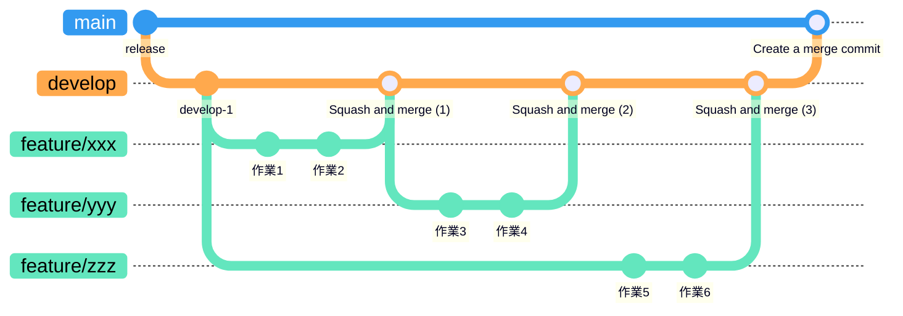

## はじめに

この記事で書くのは2つ。

1. **ブランチ戦略**: `main` への直接pushを避け、常にデプロイ可能な状態を保ちながら、ブランチの種類を増やして複雑化させず、多人数の開発にも耐えられる形をどう作るか
2. **CIの多層防御**: 静的チェック・ビルド・テスト・SAST・SCAは網羅的にやりたいが、全部を全タイミングで実行するとコストが高すぎる。何を、どこに置くか

どちらも、最初はなんとなく適当にやっていたのを、改めて考え直したり実測を踏まえて整理し直した話。特にCIの配置は、感覚で「軽いはず」と思っていたチェックが実測で全然軽くなかった、という話が出てくる。

---

## ブランチ戦略

このブランチ戦略が目指しているのは次の4つ。

- **mainへの直接pushを避けたい**: `main` は常に安定した状態であってほしい
- **mainは常にデプロイ可能（テスト済）な状態であること**: `main` のHEADが壊れた状態のまま放置されないようにする
- **ブランチの種類を増やして複雑化させないこと**: Git Flowの `release/*` ・ `hotfix/*` のような追加ブランチは持たない
- **多人数の開発に耐えられること**: 1人だけの開発なら `develop` すら要らない。複数人が同時に複数の機能を並行して作る場合に、ある程度の運用ルールがないと破綻する。`develop` と `feature/*` はこの前提のためにある

### コミットグラフ



`develop` は `main` から切られたまま何度もfeatureを取り込み、ある程度まとまったところで `main` にマージコミットで合流する。`feature/*` は都度 `develop` から新しく切るブランチで、squashで1コミットにまとめて`develop`に戻ったら役目を終える。同じ`feature/*`を使い回すことはない。

### 各ブランチの役割

| ブランチ | 役割 |
|---|---|
| `feature/*` | 個別の機能追加・バグ修正。`develop` から分岐する |
| `develop` | 開発中の変更を集約する。**デフォルトブランチ** |
| `main` | リリース済みの安定版 |

### 位置づけ

これはGit Flowの簡略版にあたる。Git Flowは `main` / `develop` / `feature/*` / `release/*` / `hotfix/*` の5種類のブランチを使うが、ここでは `release/*` と `hotfix/*` を省き、`develop → main` のマージがそのままリリースになる形にしている。

### なぜこうしているか

以下は、冒頭の4つを実現するための個別の判断。

#### `develop` をデフォルトブランチにしている

PR作成時のベースブランチが自動で `develop` になるため、`main` 宛に誤ってPRを出す事故を減らせる。

#### `feature/* → develop` は Squash and merge

feature ブランチ内の細かいコミット（wip、typo修正など）を1つにまとめ、`develop` の履歴を機能単位で追えるようにするため。

#### `develop → main` はマージコミット（squashは使わない）

squash で `develop` を `main` に取り込むと、**両ブランチの共通祖先（merge-base）がリリースごとにズレていく。**

普段は実害がないが、コード全体を書き換える変更と重なると大量の誤コンフリクトが発生する。実際にフォーマッタを導入したリリースで、ファイルリネームの誤検出や add/add コンフリクトが起きて原因究明に時間を取られたことがあった。

マージコミットなら `develop` の履歴がそのまま `main` に引き継がれるため、この問題が起きない。GitHub上では両方式を有効にしておき、人が使い分けている（自動判別はしていない）。

#### 直接pushの禁止は「運用ルール」であって、強制ではない

強制できるなら、ブランチ保護ルール（PR必須化・直接push禁止の強制）を設定するに越したことはない。ただ、それが技術的に設定できない環境も珍しくない（例えばGitHub Freeプランの非公開リポジトリはこれに該当する）。

強制できないからこそ、直接push禁止は運用ルールとして決めるしかない。強制できない代わりに、CIで事後検知する仕組みを置く。これが次の話。

---

## CIの多層防御

チェックは網羅的にやりたい。静的チェック・ビルド・SAST・単体・結合・E2E・SCA、どれも欠けると事故につながる。だが全部を全タイミングで実行すると、コストが高すぎて誰も待てなくなる。

だから「どのチェックを、どのタイミングに置くか」を最適化する。これがこの章の内容。

### 配置の原則

原則は3つ。

- **頻度 × 所要時間**: 頻度が高い場所ほど短いチェックしか置けない。pre-commitは1日に何十回も走るので数秒で終わるものだけ、pre-pushは頻度が1桁少ないので数十秒かかるものまで許容、PRやスケジュールは頻度がさらに低いので分単位でも問題ない
- **層ごとに防ぐ対象が違う**: pre-commitは「壊れたコミットを履歴に残しにくくする」、pre-pushは「壊れたものを共有リポジトリに出しにくくする」、PRは「通常経路における最終検査」、mainへのマージは「`main`のHEADが壊れていないかを検知する」、スケジュールは「時間経過で増えるリスクを検知する」
- **同じ状態への重複は避ける**: 同じ変更・同じ状態に同じチェックを何度も走らせるコストは避ける。`feature/**` へのpushやdevelopへのマージでCIを実行しないのはこの原則による。一方でmain宛PRとmainへのマージは、チェックの内容は同じでも検査対象が違う。PRは「マージされる予定の状態」、マージ後は「実際にマージされた状態」を見ている。同じ状態を2回検査しているわけではないので、これは重複にあたらない

### SASTとは？SCAとは？

**SAST**と**SCA**は検査対象が違う。SASTは自分たちが書いたコードを実行せずに静的解析し、危険な構文パターンや、信頼できない入力が危険な処理に到達するデータフローなど（例: `eval()`の使用、SQLの文字列連結など）を検査する。SCAは使っている依存ライブラリに既知の脆弱性（CVE）が無いかを、lockfile（`package-lock.json`など）を読んで検査する。今回はSASTに**Semgrep**、SCAに**Trivy**を使っている。

### 実行タイミング

| タイミング | Lint・型 | ビルド | SAST | 単体 | 結合 | E2E | SCA |
|---|---|---|---|---|---|---|---|
| pre-commit | 実行 | - | - | - | - | - | - |
| pre-push | - | 実行 | 実行 | 実行 | 実行 | - | - |
| `feature/**` へのpush | - | - | - | - | - | - | - |
| develop宛PR | 実行 | 実行 | 実行 | 実行 | 実行 | - | 実行 |
| developへのマージ | - | - | - | - | - | - | - |
| main宛PR | 実行 | 実行 | 実行 | 実行 | 実行 | 実行（※1） | 実行 |
| mainへのマージ | 実行 | 実行 | 実行 | 実行 | 実行 | - | 実行 |
| 週次スケジュール | - | - | - | - | - | - | 実行 |

:::note warn
※1 E2E（Playwright）だけは自動化していない。実ブラウザでの操作を伴い、バックエンドと実DBの起動が前提になるため、CI上で安定して動かす環境をまだ整備できていない。表の「実行（※1）」は、`develop → main` のPRを作る前にローカルで手動で全件実行することを指す。
:::

### 各配置の理由

#### ローカルフックの実行基盤

pre-commit / pre-pushはhusky（gitフック管理ツール）とlint-staged（ステージ済みファイルだけにチェックを適用するツール）で組んでいる。

一点だけ補足。huskyの有効化には通常`package.json`に`"prepare": "husky"`と書くが、**Yarn Berry（Yarn 2以降）は`prepare`スクリプトを実行しない仕様**なので、この書き方だとフックが一度も動かない。Yarn Berryを使っている場合は`"postinstall": "husky && ..."`のように書く必要がある。

#### pre-commit と pre-push の切り分けは実測で決めた

当初、SAST（静的アプリケーションセキュリティテスト）ツールを「差分だけ検査するから軽い」という思い込みでpre-commitに置いていた。実測したところこうなった。

| チェック | 対象範囲 | 所要 |
|---|---|---|
| lint（差分のみ） | ステージ済み差分 | 数秒 |
| 型チェック | プロジェクト全体 | 2.0秒 |
| **SAST（1ファイルのみ）** | 1ファイル | **17.8秒** |
| **SAST（209ファイル）** | 209ファイル | **19.8秒** |
| 単体テスト | 全件 | 4.0秒 |

**1ファイルに絞っても17.8秒、209ファイル全体でも19.8秒。** ファイル数が209倍になっても大差なかった。検査対象の数より、数百本のルールを読み込んでパース・検証する固定コストの方が支配的だったためと考えられる。

:::note warn
この数字は、あるプロジェクトで1回計測した記録にすぎない。言語・ファイル数・SASTツールの設定が違えば傾向も変わりうるので、この数字をそのまま流用せず、自分のプロジェクトで同じように計測してから配置を決めてほしい。
:::

結果として「重いからpre-pushに置いた」テスト（4秒）より5倍近く遅い、という逆転が起きていた。commitごとに20秒待たされるとフック回避（`--no-verify`）の動機になるため、pre-pushへ移した。

ついでに差分への絞り込み自体もやめた。差が2秒しかないなら、絞り込みの複雑さを維持する価値がない。やめたことでスキャン範囲がローカルとCIで一致し、既存ファイルへの間接的な影響も検知できるようになった。

#### `feature/**` へのpushでCIを実行しない

GitHubの無料枠はActionsの実行時間がアカウント単位で共有されている。1つのプロジェクトだけなら枠内に収まるが、`feature/**` へのpushは1日に何度も起きるため、複数プロジェクトを抱えていると合算で枠を圧迫しかねない。ここで毎回CIを回すのは避けたいので、pushの時点では実行しない。ローカルフックが同等のチェックを担い、develop宛PRが最終ゲートになるので、間引いても実害は小さい。以前はpushとPRの両方でワークフローが起動し、同一コミットに対してジョブが2回走っていた。

ただしフックはCIと完全に等価ではない。以下は「PR作成時まで検知されない」に変わる。

| 差分 | 内容 |
|---|---|
| クリーン環境での再現性 | CIは依存関係を入れ直すため、lockfileの不整合や「手元では通るが他人の環境では落ちる」を検知できる |
| Linterの検査範囲 | フックは差分の新規指摘のみ、CIはプロジェクト全体 |
| SCA | ローカルには導入していない |

#### `develop` へのマージでCIを実行しない

`feature/* → develop` のPR時点で全チェック済み。developへのマージは全経路の中で最も頻度が高いため、二重化のコストが見合わない。

ただし、これはリスクをゼロにしているわけではない。後述する「semantic conflict」（Approve後に別のPRが先に入ることで、組み合わせて壊れる）はdevelopでも同様に起こり得る。developはmainより変更頻度が高く、都度検査するコストが見合わないため、このリスクを許容している。

#### `main` へのマージでCIを実行する

main宛PRとほぼ同じ内容が、mainへのマージ時にも走る。PRと push(main) の両方でCIを回すのはよくある構成で、無駄に2回やっているわけではない。

一番の理由は、**`main` のHEADが壊れていないかを検知するため。** マージ後に検査するだけなので、壊れてから検知・修正するまでの間は `main` のHEADも赤になる。「保証」まではできないが、それでも検知する価値はある。PR上のブランチで通っていても、マージ後の実際の `main` で同じ結果になるとは限らない。典型的には「semantic conflict」と呼ばれる状況で、PRのCIはPR作成・更新時点の `main` との組み合わせでテストされるが、Approveからマージまでの間に別のPRが先にmainへ入ると、その組み合わせでは問題が起きることがある。それぞれのPR単体のCIはどちらもgreenなので、PR時点のチェックだけでは検知できない。マージという操作そのものの後に、もう一度検査するのはこのため。

副次的な効果として、ブランチ保護ルールが働いていない環境では、`main` への直接pushで壊れた変更が入った場合に、それを検知する唯一の手段にもなる。ただし限界もあって、「壊れた直接push」は検知できても、テストが通る直接pushはPRマージと区別できない。developへの直接pushは検知しない、という割り切りもある。

#### `main` へのpushでは `concurrency` をキャンセルしない

PRへの再pushでは古い実行をキャンセルするが、`main` へのpushではキャンセルしない。キャンセルすると、そのコミットが緑だった証跡が残らないため。

```yaml
concurrency:
  group: ci-${{ github.event.pull_request.number || github.ref }}
  cancel-in-progress: ${{ github.event_name == 'pull_request' }}
```

厳密には同じ `group` 内で保留になれるのは1件だけなので、短時間に3回以上pushすると中間コミットの検査結果は消える。それでも直近のpushの結果は必ず残る。

#### 週次スケジュールでSCAを実行する

依存ライブラリの脆弱性（CVE）をSCAで検査しているが、CVEは日々公開される一方、リリースは月に数回。**マージ契機のスキャンだけでは検知が数週間遅れる。** 時間契機のスキャンを別に持つことで、おおむね7日以内に気づける（スケジュール実行はGitHub Actions側の負荷状況により遅延することがあるため、厳密な保証ではない）。

```yaml
on:
  schedule:
    - cron: "17 9 * * 1"   # 毎週月曜 09:17 JST頃
      timezone: "Asia/Tokyo"
  workflow_dispatch:

jobs:
  scan:
    strategy:
      fail-fast: false     # developが落ちてもmainの結果を得る
      matrix:
        branch: [develop, main]
    steps:
      - uses: actions/checkout@...
        with:
          ref: ${{ matrix.branch }}
```

`develop` と `main` の両方をスキャンする。デフォルトブランチ以外もスキャン対象にする場合、スケジュール実行時のcheckoutは既定でデフォルトブランチになるので、`matrix` などで明示的に指定する必要がある。

---

## まとめ

**ブランチ戦略**

- **マージ方式は履歴の意味で選ぶ。** squashを多用すると共通祖先がリリースごとにズレ、大規模な変更時に誤コンフリクトを招くことがある
- **強制できないルールは、運用と検知で補う。** ブランチ保護が働かない環境では、直接push禁止を運用ルールとして決め、CIの事後検知で埋める

**CIの多層防御**

- **チェックの配置は思い込みではなく実測で決める。** 「差分だから軽い」は成立しないことがある
- **絞り込みは常に得とは限らない。** 節約が数秒なら、単純さとカバレッジを取ったほうがいい
- **時間で増えるリスクは、時間契機で検査する。** 依存の脆弱性はマージ契機だけでは追いつかない
