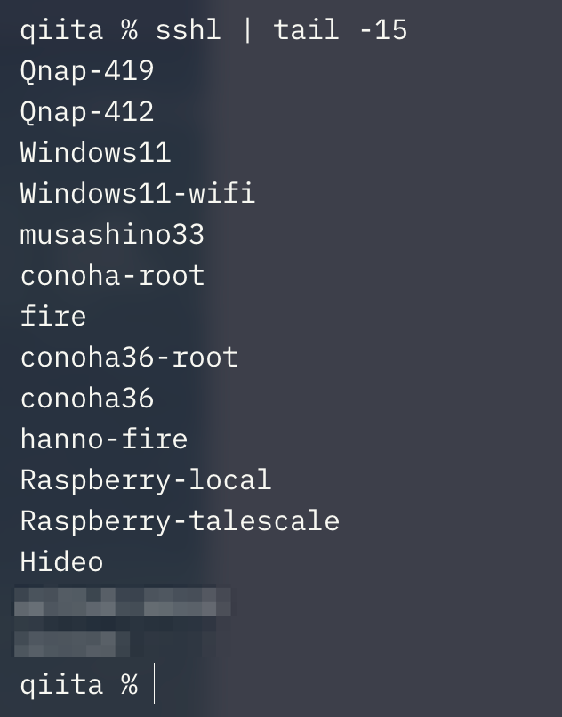

## SSH 接続先を fzf で選びたい

自分は、SSH の接続先を基本的に全部 `~/.ssh/config` に書いている。

そうしていると、`~/.ssh/config` の中に Host がどんどん増えていく。

`dev-server` だったか、`dev-app` だったか。短い名前ならまだいいけど、似た名前が増えると普通に探しづらい。

そこで `~/.ssh/config` に書いてある `Host` を `fzf` で選んで、そのまま SSH できるようにした。

たとえば、これまでこう打っていたものを、

```sh
ssh dev-server
```

こうできる。

```sh
sshi
```


`sshi` を実行すると、`~/.ssh/config` に登録済みの `Host` が一覧表示される。あとは `fzf` で数文字入力して、Enter で接続する。

小さい alias だけど、`~/.ssh/config` の中から接続先を探す時間が減る。

## セットアップ

### 必要なツール

使うのはこの3つ。

| 必要なもの | 役割 |
|---|---|
| `~/.ssh/config` | SSH の接続先一覧として使う |
| `fzf` | 接続先をインクリメンタルサーチする |
| alias | `Host` を取り出して SSH する |

この記事では `~/.ssh/config` の書き方は扱わない。すでに `ssh dev-server` のように Host 名で SSH できている前提。

### fzf を入れる

macOS なら Homebrew で入れる。

```sh
brew install fzf
```

```sh
fzf --version
```

### alias を追加する

`~/.zshrc` などに以下を追加する。

```sh
alias sshl="cat ~/.ssh/config | grep '^Host ' | sed -e 's/^Host //g'"
alias sshi="sshl | fzf | xargs -I{} sh -c 'ssh {} </dev/tty' ssh"
```

追加したら、設定を読み込み直す。

```sh
source ~/.zshrc
```

これで `sshi` が使える。

`sshl` は、`~/.ssh/config` から `Host` だけを取り出すための alias。

```sh
sshl
```



`sshl` は `Host ` で始まる行を拾って、先頭の `Host ` だけ削っている。

`sshi` は、その一覧を `fzf` に渡して、選んだ Host に `ssh` する。

## 使ってみて

SSH の接続先を必ず `~/.ssh/config` に書く運用だと、Host の数は自然に増えていく。

そういう人なら、`sshi` で一覧から絞り込めるだけでもだいぶ楽になる。`~/.ssh/config` を開いて Host 名を探す回数も減る。

逆に、接続先が少ないなら普通に `ssh host-name` と打つほうが早い。`fzf` も別途必要なので、誰にでも入れておくものではないと思う。

自分は、SSH の接続先を `~/.ssh/config` に書いて、この alias で選ぶ形にしている。
