## はじめに

外出中に自宅のWindowsが必要になることがある。Windowsにしか入っていない開発環境があって、これだけはどうしても代替が効かない。

かといってWindowsを起動しっぱなしで出るのも嫌なので、スリープ中のWindowsをコマンド一発で起こして操作できる仕組みをWake-on-LAN + Tailscale + RDPで作った。

| 技術 | 役割 |
|------|------|
| **Wake-on-LAN（WoL）** | スリープ中のPCをネットワーク経由で起動する |
| **Tailscale** | インターネット越しにデバイス同士をVPNでつなぐ |
| **RDP（リモートデスクトップ）** | Windowsの画面を遠隔操作する |

いきなり外出先から試すと詰まりやすいので、まず自宅LAN内で動かしてからTailscaleを足す順番で進める。

- **フェーズ1**：自宅LAN内で Wake-on-LAN + RDP を動かす
- **フェーズ2**：Tailscale を足して外出先から同じことをする

---

## 全体構成と登場人物

### 登場するデバイス

| デバイス | OS | 役割 |
|----------|----|------|
| Mac Studio | macOS | 自宅の操作端末（普段使い） |
| MacBook Pro | macOS | 外出先の操作端末 |
| Windows 11 Pro | Windows | 接続先・有線LAN接続 |
| Raspberry Pi | Linux | WoLの中継役・常時起動 |

WindowsをWoLで起こすには**常時起動しているデバイス**が必要で、長い間眠っていたRaspberry Pi 2 Model B（UD-RP2）をその役割に使った。古い機種だが、WoLパケットを送るだけなら十分。消費電力も低いので常時起動に向いている。

### フェーズ1：自宅LAN内の構成図

Mac StudioからRaspberry PiにSSH接続してWoLコマンドを実行し、Raspberry Piがスリープ中のWindowsにマジックパケットを送って起動させます。起動後はMac StudioからWindowsにRDPで直接接続します。

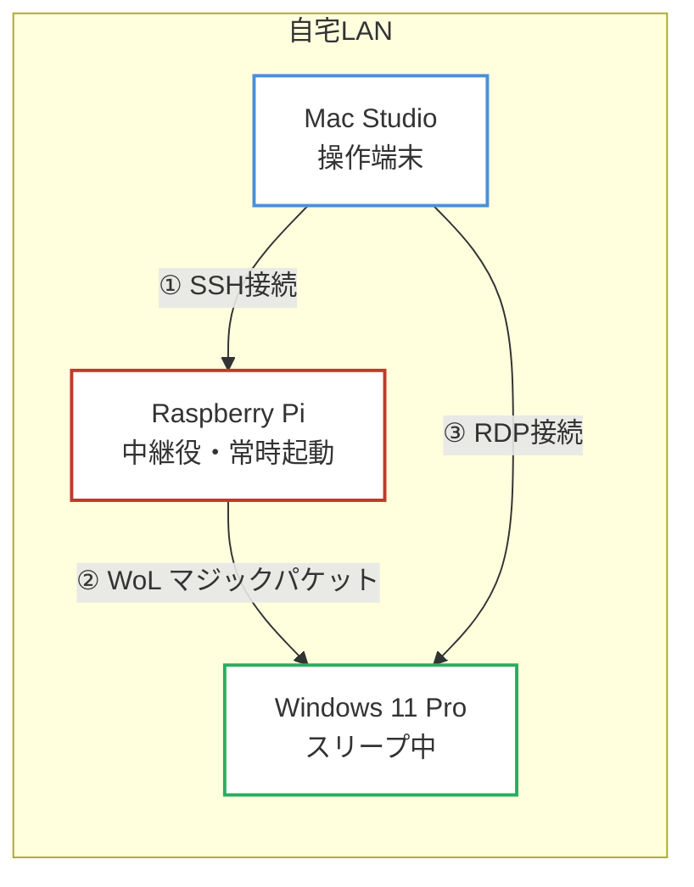

#### シーケンス図

各デバイス間の通信の流れを示します。Raspberry Piを中継してWindowsを起動させ、起動完了を待ってからRDP接続する順序がポイントです。

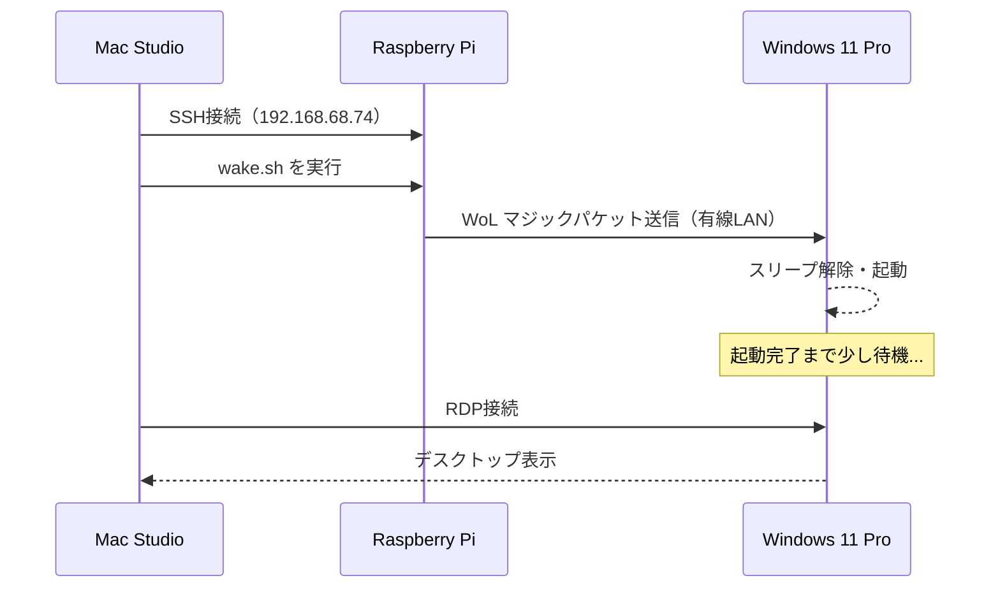

### フェーズ2：Tailscale経由の構成図

外出先のMacBook ProとRaspberry Pi・WindowsがTailscale VPN経由でつながります。フェーズ1と操作の流れは同じですが、SSHもRDPもすべてTailscaleのIPアドレスを使って通信します。

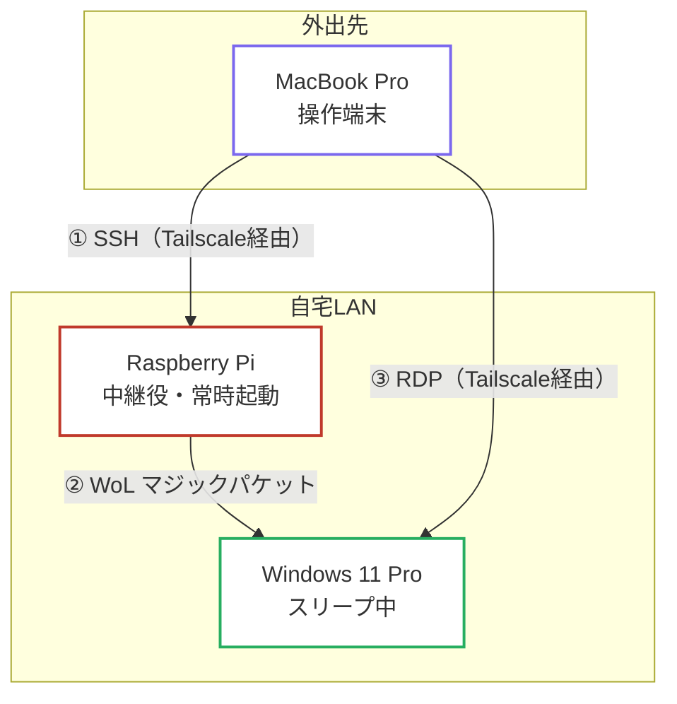

#### シーケンス図

フェーズ1との違いは、SSHとRDPがTailscale経由になる点と、Windows起動後にTailscaleサービスが自動接続されるのを待つ点です。

```mermaid
%%{init: {'theme': 'base', 'themeCSS': '.mermaid, .mermaid svg, svg, svg[role="graphics-document"] { background: #ffffff !important; } .messageText, .loopText, .noteText, .labelText, .actor > text { fill: #1f2937 !important; color: #1f2937 !important; }', 'themeVariables': {'background': '#ffffff', 'mainBkg': '#ffffff', 'primaryTextColor': '#1f2937', 'textColor': '#1f2937', 'actorBkg': '#7B68EE', 'actorTextColor': '#ffffff', 'actorBorder': '#5A4FCF', 'activationBkgColor': '#EDE9FE', 'activationBorderColor': '#5A4FCF', 'sequenceNumberColor': '#1f2937', 'lineColor': '#5A4FCF', 'signalColor': '#5A4FCF', 'signalTextColor': '#1f2937', 'labelBoxBkgColor': '#ffffff', 'labelBoxBorderColor': '#CBD5E1', 'labelTextColor': '#1f2937', 'loopTextColor': '#1f2937', 'noteBkgColor': '#E8F8FF', 'noteTextColor': '#374151', 'noteBorderColor': '#0284C7'}}}%%
sequenceDiagram
    participant Mac as MacBook Pro（外出先）
    participant Pi as Raspberry Pi
    participant Win as Windows 11 Pro
    Note over Mac,Win: Tailscale VPN で接続済み
    Mac->>Pi: SSH接続（100.83.12.94 via Tailscale）
    Mac->>Pi: wake.sh を実行
    Pi->>Win: WoL マジックパケット送信（有線LAN）
    Win-->>Win: スリープ解除・起動
    Win-->>Win: Tailscale サービス自動接続
    Note over Win: 起動完了まで少し待機...
    Mac->>Win: RDP接続（100.119.171.112 via Tailscale）
    Win-->>Mac: デスクトップ表示
```

---

## フェーズ1：自宅LAN内でWoL環境を作る

### 必要条件

フェーズ1を動かすには以下が必要です。

- Windows PC が **有線LAN接続**であること（WoLは無線LANでは基本動作しない）
- 自宅ネットワークに**常時起動しているデバイス**があること（今回はRaspberry Pi）

### Windowsの設定

#### 1. BIOS/UEFIでWoLを有効にする

PCの電源投入直後に `Del` や `F2` キーを押してBIOS/UEFIを開き、**Wake-on-LAN** または **Power On By PCI-E** の項目を有効にします。

:::note
BIOS画面はメーカー・機種によって異なります。「Wake on LAN」「Resume By PCI-E」などの名称で見つかることが多いです。
:::

#### 2. NICドライバのWoL設定を有効にする

「デバイスマネージャー」→「ネットワークアダプター」から有線NICを右クリックして「プロパティ」を開きます。

「電源の管理」タブを開き、以下の項目すべてにチェックを入れます。

- このデバイスで、コンピューターのスタンバイ状態を解除できるようにする
- 管理ステーションでのみ、コンピューターのスタンバイ状態を解除できるようにする
- Wake on Magic Packet

<!-- 📸 NICプロパティの「電源の管理」タブ。3つのWoL関連チェックボックスがすべてオンになっている状態 -->
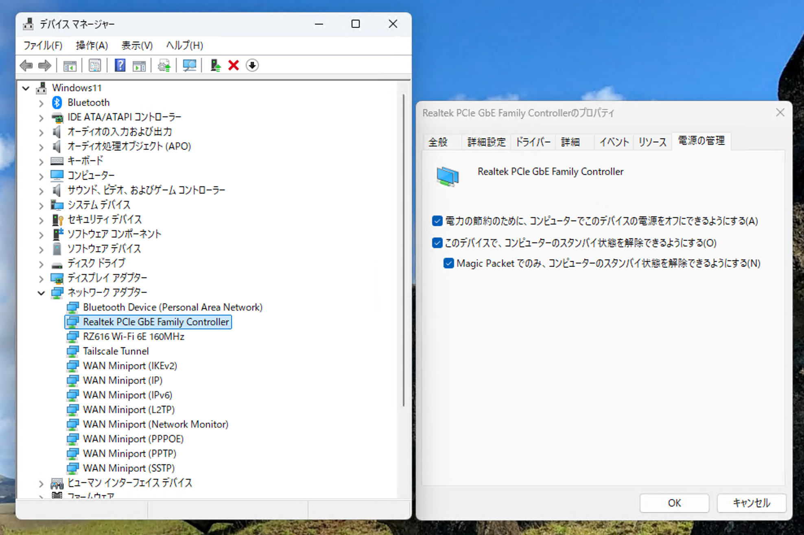

続いて「詳細設定」タブを開き、プロパティ一覧から **「ウェイク・オン・マジック・パケット」** を選択して、値を **「有効」** に設定します。

<!-- 📸 NICプロパティの「詳細設定」タブ。「ウェイク・オン・マジック・パケット」を選択し、値が「有効」になっている状態 -->
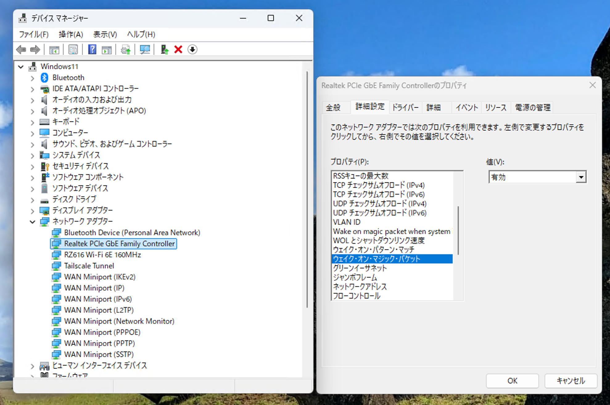

#### 3. リモートデスクトップ（RDP）を有効にする

「設定」→「システム」→「リモートデスクトップ」を開き、「リモートデスクトップを有効にする」をオンにします。

<!-- 📸 Windowsの設定→システム→リモートデスクトップ。「リモートデスクトップを有効にする」がオンになっている状態 -->
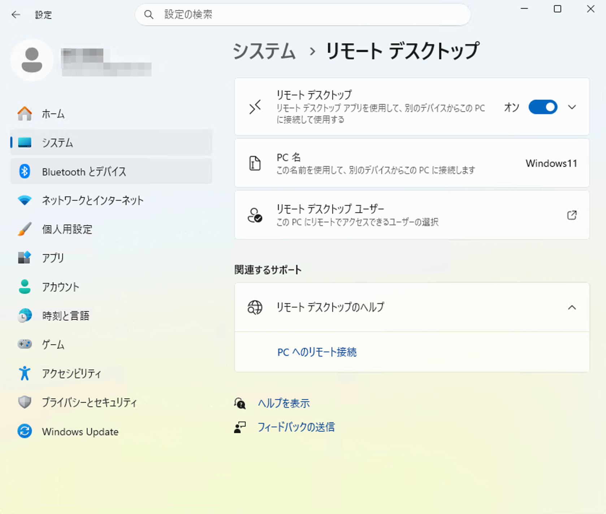

#### WindowsのローカルIPを固定する

RDP接続先のIPが変わると接続できなくなります。ルーターのDHCP固定設定でWindowsのIPを固定しておきます。この記事では `192.168.68.111` を使用します。

#### WindowsのNIC MACアドレスを確認する

後でWoLの設定に使うため、有線NICのMACアドレスをメモしておきます。コマンドプロンプトで確認できます。

```cmd
ipconfig /all
```

「イーサネット アダプター」の「物理アドレス」がMACアドレスです（例：`9C-6B-00-79-C7-D9`）。

<!-- 📸 コマンドプロンプトでipconfig /allを実行した結果。イーサネットアダプターの物理アドレスが表示されている -->
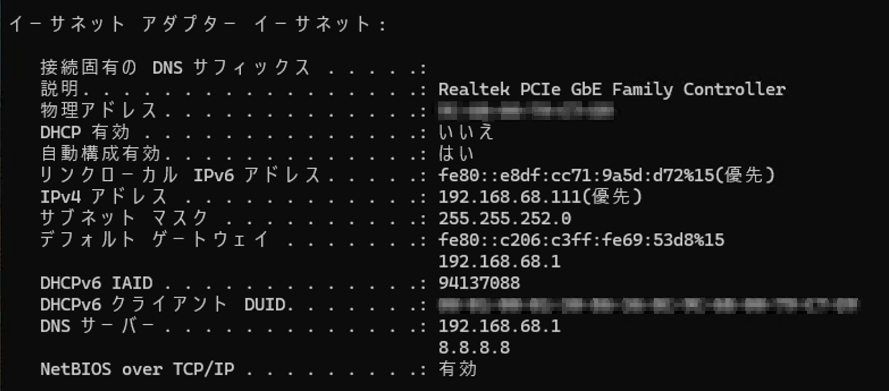

---

### Raspberry Piの設定

#### 1. wakeonlanのインストール

```bash
sudo apt install -y wakeonlan
```

#### 2. wake.sh の作成

`XX:XX:XX:XX:XX:XX` の部分は先ほど確認したWindowsのMACアドレス（コロン区切り）に置き換えてください。

```bash
echo "wakeonlan XX:XX:XX:XX:XX:XX" > ~/wake.sh
chmod +x ~/wake.sh
```

#### 3. ローカルIPを固定する

Raspberry PiのローカルIPが変わるとSSH接続できなくなります。ルーターのDHCP固定設定、またはRaspberry Pi側でスタティックIPを設定しておきます。この記事では `192.168.68.74` を使用します。

---

### Macの設定

#### 1. wakeエイリアスの設定

`~/.zshrc` に以下を追記します。IPアドレスはRaspberry PiのローカルIPに合わせてください。

```bash
# ~/.zshrc
alias wake="ssh ユーザー名@192.168.68.74 ./wake.sh"
```

追記後、反映します。

```bash
source ~/.zshrc
```

#### 2. Windows Appのインストール

App StoreからWindows Appをインストールします。

<!-- 📸 App StoreのWindows Appのページ -->
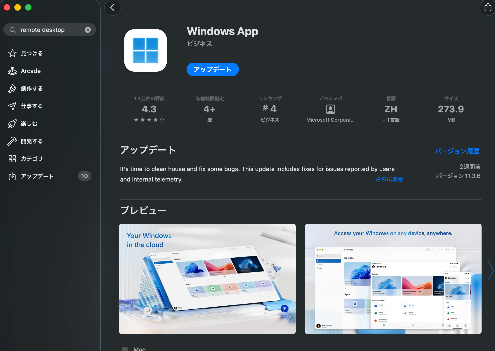

---

### フェーズ1の動作確認

すべての設定が終わったら動作を確認します。

#### 手順

1. Windowsをスリープ状態にする
2. Mac のターミナルで `wake` を実行する

```bash
wake
```

<!-- 📸 ターミナルでwakeコマンドを実行した様子。Raspberry PiへのSSH接続ログが表示されている -->
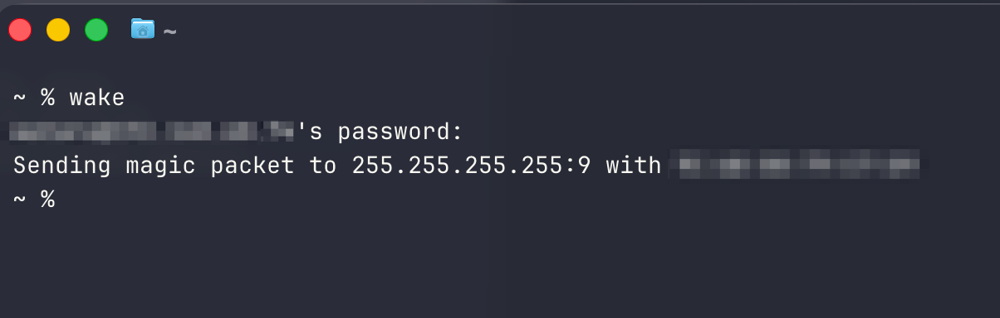

3. しばらく待ってWindowsが起動したら、Windows Appから接続する
4. 接続先にWindowsのローカルIPアドレスを指定する

<!-- 📸 Windows AppにWindowsのIPアドレスを入力している画面 -->
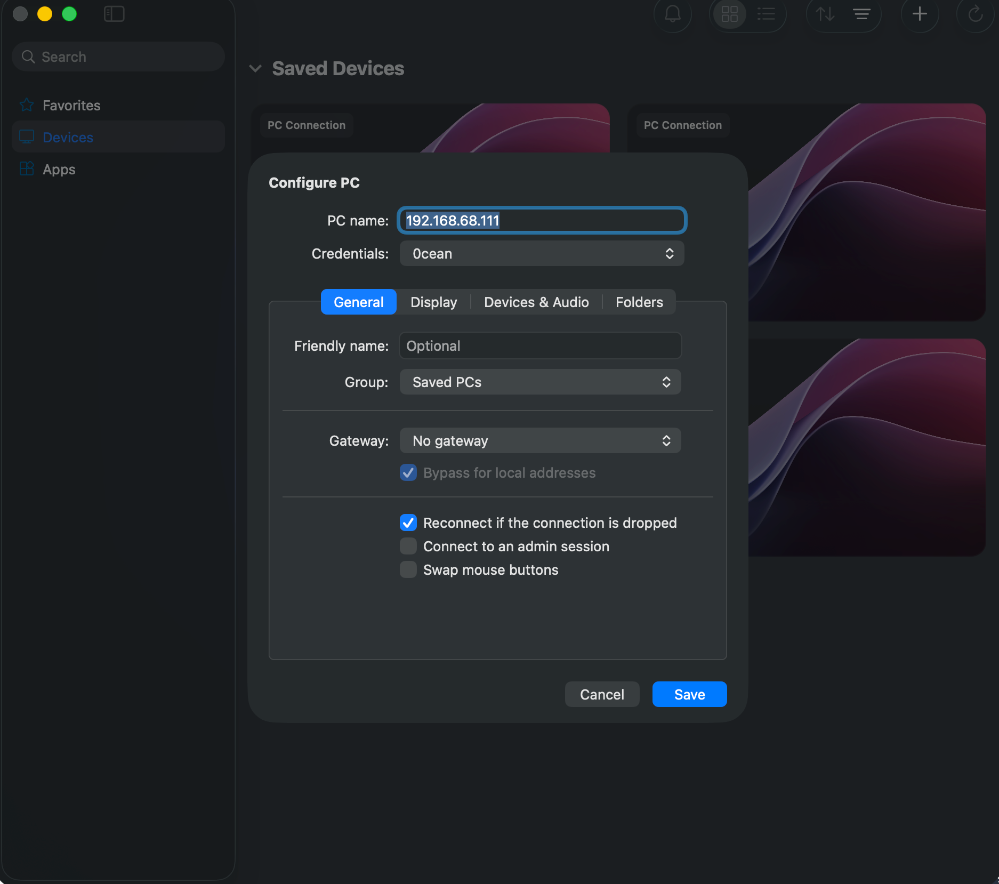

<!-- 📸 RDPでWindowsのデスクトップに接続できた状態 -->
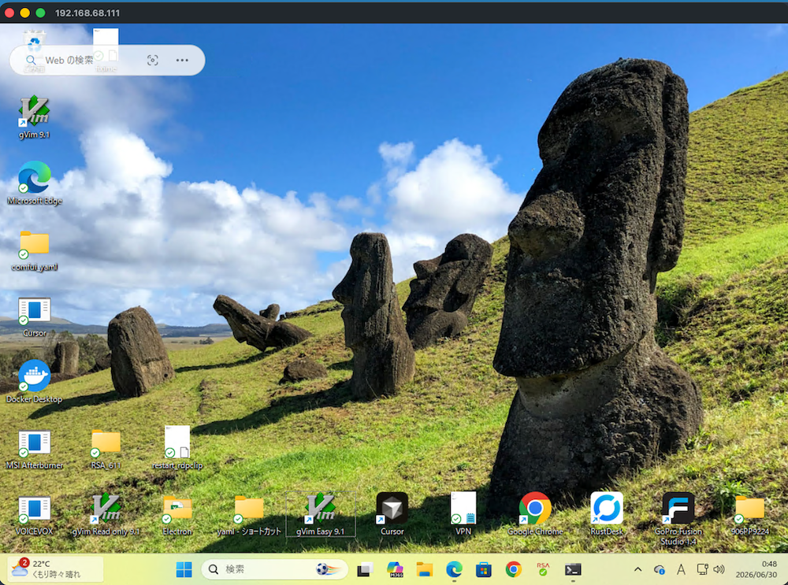

:::note warn
`wake` 実行後、Windowsが起動するまで30秒〜1分程度かかります。すぐにRDP接続しようとしても繋がらないので少し待ちましょう。
:::

---

## フェーズ2：Tailscale経由で外出先から接続する

フェーズ1が自宅LAN内で動作することを確認できたら、次はインターネット越しに同じことをします。

### Tailscaleとは

Tailscaleは、複数のデバイスを仮想的なプライベートネットワーク（VPN）でつなぐサービスです。インストールしてログインするだけで、異なるネットワークにあるデバイス同士が直接通信できるようになります。

各デバイスに `100.x.x.x` という固定のIPが割り当てられ、どこからでもそのIPで接続できます。

### Tailscaleのセットアップ

#### 1. 全デバイスにTailscaleをインストール

以下のデバイスすべてに Tailscale をインストールして、**同一アカウントでログイン**します。

- MacBook Pro（外出先の操作端末）
- Raspberry Pi
- Windows 11 Pro

[Tailscale公式サイト](https://tailscale.com/download)からOSに合わせてインストールします。

Raspberry Piへのインストールはaptで入る。

```bash
sudo apt update
sudo apt install -y tailscale
sudo tailscale up
```

起動確認は `systemctl status tailscaled` で。`active (running)` になっていればOK。

```bash
sudo systemctl status tailscaled
```

```
● tailscaled.service - Tailscale node agent
     Loaded: loaded (/lib/systemd/system/tailscaled.service; enabled; preset: enabled)
     Active: active (running) since Fri 2026-05-29 08:24:37 JST; 1 month 1 day ago
     Status: "Connected; xxxxx@gmail.com; 100.83.12.94 fd7a:115c:a1e0::9c01:c63"
```

スリープ復帰後も自動起動されるか、enableになっているかも確認しておく。

```bash
systemctl is-enabled tailscaled
```

```
enabled
```

#### 2. 管理画面でデバイスの接続を確認する

Tailscaleの管理画面（[login.tailscale.com](https://login.tailscale.com)）にアクセスし、全デバイスがオンラインになっていることを確認します。各デバイスに割り当てられたIPアドレスをメモしておきます。

<!-- 📸 Tailscale管理画面。全デバイス（Mac Studio, MacBook Pro, Windows, Raspberry Pi）がオンラインになっている状態。各デバイスのIPアドレスが見える -->
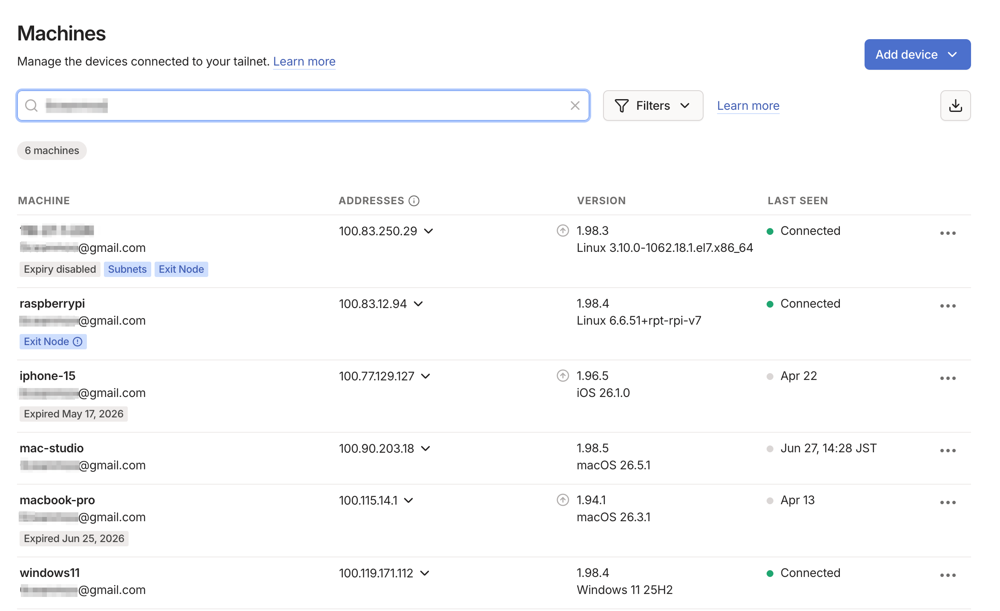

#### 3. WindowsのTailscaleがスリープ復帰後に自動接続されることを確認する

Windowsがスリープから復帰したとき、Tailscaleが自動接続されていないとRDPできない。ここを確認し忘れると、rwakeを実行してもRDPが繋がらずに詰まる。

Tailscaleのサービスが「自動（スタートアップの種類）」かつ「実行中（状態）」になっていることを確認します。

タスクマネージャー → 「サービス」タブ → `Tailscale` を探します。

<!-- 📸 タスクマネージャーのサービスタブ。Tailscaleが「実行中」になっている状態 -->
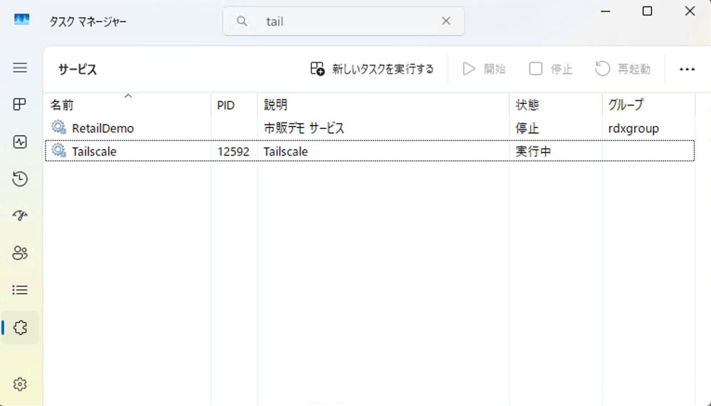

---

### Macの設定変更

外出先用のコマンドを追加します。`~/.zshrc` に `rwake` エイリアスを追記します。

```bash
# ~/.zshrc
alias wake="ssh ユーザー名@192.168.68.74 ./wake.sh"       # 自宅用（LAN内）
alias rwake="ssh ユーザー名@100.83.12.94 ./wake.sh"      # 外出先用（Tailscale経由）
```

```bash
source ~/.zshrc
```

---

### フェーズ2の動作確認

#### 手順

1. MacBook ProでTailscaleが接続中であることを確認する

<!-- 📸 MacBook ProのメニューバーのTailscaleアイコン。接続中の状態 -->
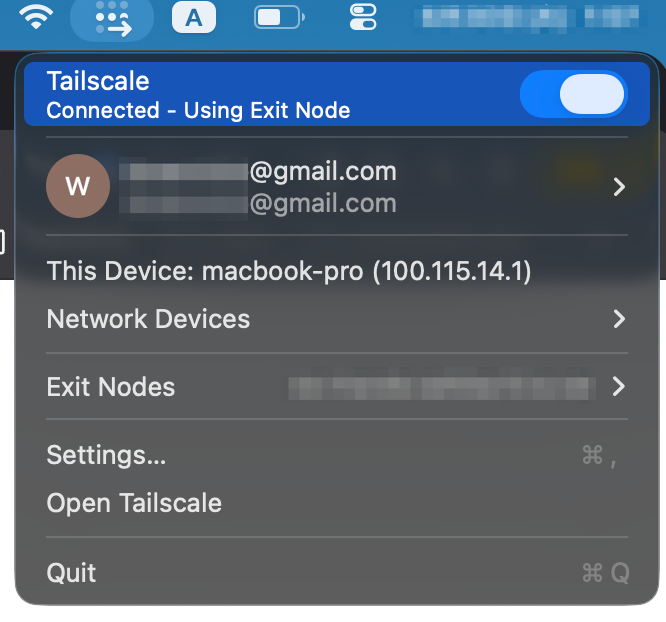

2. Windowsをスリープ状態にする
3. MacBook Proのターミナルで `rwake` を実行する

```bash
rwake
```

4. しばらく待ってWindowsが起動・Tailscale接続されたら、Windows AppからWindowsのTailscale IP（`100.119.171.112`）に接続する

<!-- 📸 外出先からRDPでWindowsのデスクトップに接続できた状態 -->
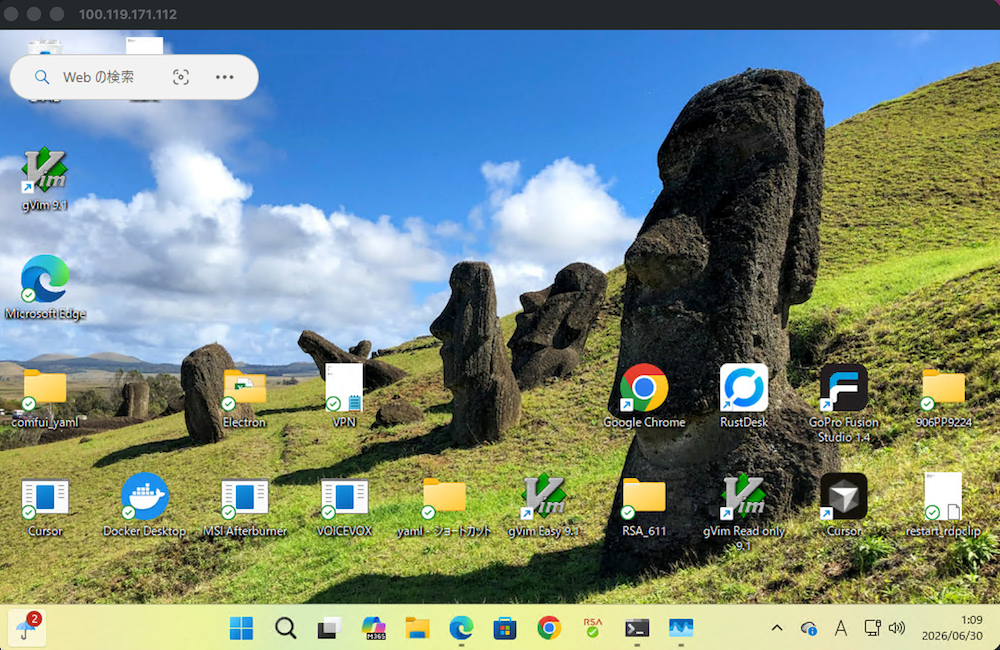

:::note
WindowsがスリープからTailscaleに接続されるまで、1〜2分かかることがあります。焦らず待ちましょう。
:::

---

## まとめ

セットアップで一番ハマりやすいのはNICのWoL設定とTailscaleの自動起動の2点で、ここさえ確認しておけばあとはほぼ一発で動く。

外出先でTailscaleに接続して `rwake` を打てば、Raspberry PiがWindowsを起こして1〜2分後にはデスクトップが手元に出てくる。電源をつけっぱなしにしなくていい。
