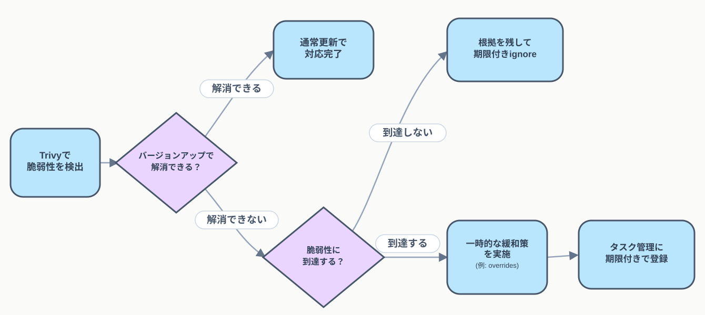

## 目次

- [はじめに](#はじめに)
- [Trivyの概要](#trivyの概要)
- [Trivy運用ルール](#trivy運用ルール)
  - [1. Trivyの実行タイミング](#1-trivyの実行タイミング)
  - [2. 脆弱性を検出した場合](#2-脆弱性を検出した場合)
  - [3. 一時的な緩和策](#3-一時的な緩和策)
  - [4. 再評価](#4-再評価)
- [まとめ](#まとめ)

## はじめに

依存ライブラリの既知の脆弱性(CVE)を検出するSCAツールとしてTrivyを使っている。この記事の主題はTrivyの使い方ではなく、「脆弱性が見つかったときに何をするか」を決めた運用ルール(実行タイミング、対応フロー、一時的な緩和策)の方。導入して終わりにすると、検出結果がCIのログに流れるだけで誰も対応しない状態になりやすい。

Trivy自体を知らない人向けに、使い方は次の章で最低限だけ触れる。

## Trivyの概要

Trivyは、Aqua Securityが開発しているオープンソースのセキュリティスキャナー。コンテナイメージ・ファイルシステム・Gitリポジトリ・Kubernetesクラスタなどを対象に、依存ライブラリの脆弱性(CVE)・OSパッケージの脆弱性・IaCの設定ミス・シークレット・SBOM生成などを検出できる。この記事で扱うのは、このうち依存ライブラリの脆弱性検出(SCA)の部分。

`trivy fs`で、ファイルシステム(lockfileを含む)をスキャンできる。実際にこのブログのリポジトリで動かしてみる。

```bash
trivy fs --scanners vuln --include-dev-deps .
```

結果はこう。

```
package-lock.json (npm)
=======================
Total: 1 (UNKNOWN: 0, LOW: 0, MEDIUM: 0, HIGH: 1, CRITICAL: 0)

┌─────────┬─────────────────────┬──────────┬────────┬────────────────────┬────────────────┬─────────────────────────┐
│ Library │    Vulnerability    │ Severity │ Status │ Installed Version  │  Fixed Version  │          Title          │
├─────────┼─────────────────────┼──────────┼────────┼────────────────────┼────────────────┼─────────────────────────┤
│ js-yaml │ GHSA-5p4m-2wfm-xmqj │ HIGH     │ fixed  │ 3.15.0             │ 4.3.1, 3.15.1   │ JS-YAML: Quadratic CPU  │
│         │                     │          │        │                    │                 │ consumption in !!omap   │
│         │                     │          │        │                    │                 │ resolution              │
└─────────┴─────────────────────┴──────────┴────────┴────────────────────┴────────────────┴─────────────────────────┘
```

`js-yaml`の3.15.0に、正規表現絡みのDoS脆弱性(CVE-2026-59870)があり、3.15.1または4.3.1で修正されている、という結果。`--include-dev-deps`を付けないとdevDependenciesがスキップされるので、CIで使う場合は最初に含めるかどうかを決めておく必要がある。

`Status: fixed`とある通り、これは修正版が既に存在するケース。次の章で扱う運用ルールは、主に「修正版がまだ無い」「修正版はあるがすぐには上げられない」ケースの話になる。

## Trivy運用ルール

### 1. Trivyの実行タイミング

- **PR作成・更新時**: 変更を取り込む前に検査する、通常の経路
- **mainへのマージ時**: `main`のHEADが壊れていないかを検知する
- **週1回のスケジュール実行**: CVEは日々新しく公開されるため、マージ契機のスキャンだけでは、直近でその依存関係に触れていない限り検知が漏れる。週次のスケジュール実行を別に持つことで、遅くとも数日〜1週間程度で気づける

PRやマージは「コードの変更」を契機にしていて、週次のスケジュール実行は「時間の経過」を契機にしている。目的が違うので、どちらかを削っていいという話にはならない。

### 2. 脆弱性を検出した場合

Trivyの指摘をAIに渡して、その場で対応してもらうこと自体はできる。ignoreやoverrideを使えば、実際に検出は消える。ただ、それだけで済ませることに引っかかりを感じるようになった。

ignoreで片付けると、今は無関係でも、将来そのライブラリの使い方が変わったときに検知そのものが働かなくなる。overrideで固定したバージョンは、ライブラリ本体が後から正式に直しても自動では外れず、上書きした設定だけがいつまでも残り続ける。どちらも「検出が消えたこと」と「問題が解決したこと」を同じものとして扱ってしまっている。この違和感を放置しないために、対応の順番を次のフローとして決めた。

<!-- Mermaid版はコメントアウト中。SVGイラスト版のみ表示する。復元する場合は全角引用符を外し、矢印記法のエスケープ(&gt;を含む箇所)を元に戻し、コードフェンスをmermaid付きで囲む

flowchart LR
    A[Trivyで脆弱性を検出] --&gt; B{通常のバージョンアップで<br/>解消できる？}

    B --&gt;|解消できる| C[通常更新で対応完了]
    B --&gt;|解消できない| D{脆弱性に到達する？}

    D --&gt;|到達しない| E[根拠を残して<br/>期限付きignore]
    D --&gt;|到達する| F[一時的な緩和策を実施<br/>例: overrides]

    F --&gt; G[タスク管理ツールに<br/>期限付きで登録]

    classDef decision fill:#e9d5ff,stroke:#475569,stroke-width:2px,color:#334155;
    classDef normal fill:#bae6fd,stroke:#475569,stroke-width:2px,color:#334155;

    class B,D decision
    class A,C,E,F,G normal
-->



- **まず通常のバージョンアップで解消できるか確認する。** さっきの`js-yaml`のように`Status: fixed`で修正版が存在するケースなら、バージョンアップだけで大抵は終わる。一番安全で速い
  - **解消できる → バージョンアップして対応完了**
  - **解消できない → 脆弱性への到達性を確認する。** 修正版がまだ無い、または修正版はあってもメジャーバージョンが上がっていて依存関係の都合(peer依存やAPIの破壊的変更)ですぐには上げられない場合はここに進む
- **到達性を確認する。** 「そのライブラリに脆弱性がある」ことと「自分たちのコードがその脆弱な処理を実際に呼んでいる」ことは別問題。Trivyはlockfileを見て既知の脆弱性が報告されているバージョンを使っているかどうかを調べているだけで、実際にそのコードパスを呼んでいるかどうかまでは判定していない。到達性の分析(reachability analysis)は今のTrivyにはなく、Snykのような商用ツールが持つ機能になる。そこまでの専用ツールを導入する規模でもないので、脆弱性の詳細(CVEの説明や修正コミットの差分)をAIに渡して、該当する関数・APIを自分たちのコードが使っているかどうかを調べてもらっている
  - **到達しない → 根拠を残して期限付きignore。** `.trivyignore`は`exp:YYYY-MM-DD`で期限を指定できる(Trivy 0.50以降)

    ```
    # 到達しない: XXX機能でのみ使用され、該当APIは呼んでいない(2026-08-18確認)
    CVE-2023-11111 exp:2026-12-31
    ```

    期限を切らずにignoreすると、判断した時点の前提(該当APIを呼んでいない)が変わっても誰も気づかず放置され続ける。期限を切っておけば、期限が来た時点で再度Trivyが検出し直すので、前提が変わっていないかを見直すきっかけになる。パスごとの除外や理由を構造化して残したい場合は`.trivyignore.yaml`もあり、`expired_at`フィールドで同じことができる
  - **到達する → 一時的な緩和策を実施し、タスク管理ツールに登録して恒久対応を追跡する。** 一時的な緩和策は、脆弱なバージョンへの依存を無理やり上書きしているだけで、依存関係グラフ上の正式な解決ではない。パッケージ側が正式に直したら上書きを外して正規の依存関係に戻す必要があり、タスクとして残しておかないとこの後始末を忘れる

### 3. 一時的な緩和策

具体的な手段は言語・パッケージ管理方式に応じて判断する。

- **npm → `overrides`**: `package.json`の`overrides`フィールドで、依存関係の奥にあるパッケージのバージョンを直接指定できる(npm 8.3.0以降)

  ```json
  {
    "overrides": {
      "js-yaml": "3.15.1"
    }
  }
  ```

- **Yarn → `resolutions`**: 同じことを`resolutions`フィールドで行う。特定の親パッケージ配下だけに絞りたい場合は`"parent-package/js-yaml": "3.15.1"`のようにパスで指定することもできる

  ```json
  {
    "resolutions": {
      "js-yaml": "3.15.1"
    }
  }
  ```

- **Go → `replace`**: `go.mod`の`replace`ディレクティブで依存モジュールのバージョンを差し替える。`replace`は自分たちのビルドにしか効かず、自分たちのモジュールを他プロジェクトが依存として使う場合、その先には伝播しない

  ```
  replace github.com/example/vulnerable-lib => github.com/example/vulnerable-lib v1.2.4
  ```

:::note warn
いずれの方法も、パッケージマネージャの正規の依存解決を上書きする点は共通している。上書き先のバージョンに互換性の問題がないかは、導入時にテストで確認する。
:::

### 4. 再評価

一時しのぎのまま放置しないための締めが再評価。

- **期限付きignore → 期限切れ後にTrivyが再検出するため、同じ判断フローで再評価する。** 判断が変わらなければ期限を延ばして再度ignore、変わっていれば緩和策側に進む
- **一時的な緩和策 → タスク管理ツールで追跡し、不要になったら解除する。** パッケージ側の正式な修正を確認したら、`overrides`や`resolutions`、`replace`を外して正規の依存関係に戻す
- **タスク管理ツール自体の定期的な棚卸し・管理方法は、この記事の対象外。** 別の運用ルールとして扱う

## まとめ

- **TrivyはSCAツールで、依存ライブラリの既知の脆弱性(CVE)をlockfile経由で検出する。** 自分たちのコードを検査するSASTとは対象が違う
- **実行タイミングはPR作成・更新時、mainへのマージ時、週1回のスケジュール実行の3つ。** コード変更契機と時間経過契機は目的が違うため、どちらも必要
- **脆弱性が見つかったら、まずバージョンアップで解消できるか確認する。** できなければ到達性を確認し、到達しなければ期限付きでignore、到達するなら一時的な緩和策とタスク管理に進む
- **到達性の判定はTrivy自体の機能ではなく、AIに調べてもらっている。** reachability analysisは今のTrivyにはない
- **ignoreと緩和策はどちらも一時しのぎで、そのままにしないための再評価まで含めて運用ルール。** ignoreは期限切れ後に同じフローで見直し、緩和策はパッケージ側の修正を確認したら外す
